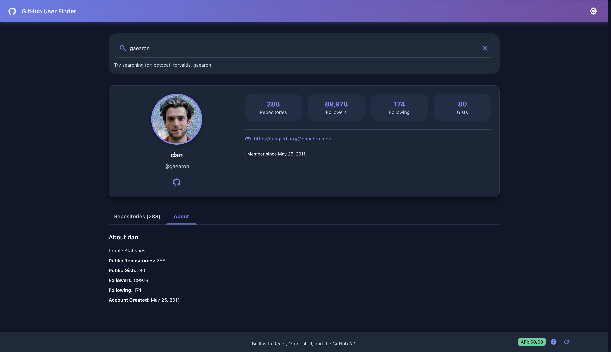

# 🔍 GitHub User Finder

<div align="center">


**A modern, feature-rich GitHub user search application with a beautiful glassmorphism UI**

[Features](#-features) • [Demo](#-demo) • [Installation](#-installation) • [Usage](#-usage) • [Tech Stack](#-tech-stack)

</div>

---

## 📋 Table of Contents

- [Overview](#-overview)
- [Features](#-features)
- [Demo](#-demo)
- [Screenshots](#-screenshots)
- [Tech Stack](#-tech-stack)
- [Installation](#-installation)
- [Usage](#-usage)
- [Project Structure](#-project-structure)
- [API Configuration](#-api-configuration)
- [Theme Customization](#-theme-customization)
- [Contributing](#-contributing)
- [License](#-license)
- [Acknowledgments](#-acknowledgments)

---

## 🌟 Overview

GitHub User Finder is a modern web application that allows you to search for GitHub users and view their profiles, repositories, and statistics. Built with React, TypeScript, and Material-UI, it features a stunning glassmorphism design, smooth animations, and a fully responsive layout.

### Why This Project?

- 🎨 **Modern Design**: Implements the latest UI trends including glassmorphism and smooth animations
- 🚀 **Performance Optimized**: Debounced search, efficient API calls, and optimized rendering
- 📱 **Fully Responsive**: Works flawlessly on desktop, tablet, and mobile devices
- 🌗 **Dark Mode**: Beautiful light and dark themes with smooth transitions
- 🔒 **Type Safe**: Built entirely with TypeScript for better code quality and maintainability

---

## ✨ Features

### 🔍 Search & Discovery
- **Real-time Search**: Debounced search with 500ms delay for optimal performance
- **Auto-complete**: Get suggestions as you type
- **Clear Button**: Quick clear functionality with proper state management
- **Search on Enter**: Press Enter to search immediately, bypassing debounce

### 👤 User Profiles
- **Detailed Information**: View username, bio, location, company, and more
- **Avatar Display**: High-quality user avatars with fallback support
- **Statistics**: Followers, following, public repos, and gists count
- **Social Links**: Direct links to blog, Twitter, email, and website
- **Join Date**: See when the user joined GitHub

### 📊 Repository Showcase
- **Repository Cards**: Beautiful cards displaying repository information
- **Key Metrics**: Stars, forks, watchers, and issues count
- **Language Badges**: Visual language indicators with colors
- **Description**: Repository descriptions with proper truncation
- **Direct Links**: Click to visit repositories on GitHub
- **Sorting Options**: Sort by stars, forks, or updated date
- **License Information**: Display repository license if available

### 🎨 Design & UX
- **Glassmorphism UI**: Modern frosted glass effect throughout
- **Smooth Animations**: Transform effects on hover and interactions
- **Custom Scrollbar**: Themed scrollbar matching the design
- **Responsive Layout**: Adaptive design for all screen sizes
- **Loading States**: Skeleton loaders and progress indicators
- **Error Handling**: User-friendly error messages and states
- **Empty States**: Informative empty state designs

### 🌗 Theme System
- **Light Mode**: Clean, bright interface with subtle shadows
- **Dark Mode**: Eye-friendly dark theme with enhanced contrast
- **Theme Toggle**: Smooth transition between themes
- **Persistent Theme**: Remembers your theme preference
- **Custom Colors**: Full semantic color palette (success, warning, error, info)

### ⚡ Performance
- **Debounced Search**: Reduces unnecessary API calls
- **Rate Limit Monitoring**: Real-time GitHub API rate limit display
- **Optimized Rendering**: React best practices and memoization
- **Lazy Loading**: Components loaded on demand
- **Efficient State Management**: Context API with optimized updates

### 🔧 Developer Experience
- **TypeScript**: Full type safety across the application
- **ESLint**: Code quality and consistency enforcement
- **Prettier**: Automatic code formatting
- **Component-based**: Modular and reusable components
- **Custom Hooks**: Reusable logic extraction
- **Error Boundaries**: Graceful error handling

---

## 🎬 Demo

### Live Demo
> **Coming Soon**: Deployment link will be added here

### Quick Demo
```bash
# Clone and run locally to see it in action
git clone <your-repo-url>
cd github-user-finder
npm install
npm start
```

---

## 📸 Screenshots

<div align="center">

### 🏠 Main Interface
| Light Mode | Dark Mode |
|:----------:|:---------:|
|  |  |

### 👤 User Profile


*Profile overview with statistics, bio, location, and social links*

### 📚 Repositories


*Infinite scrolling repository list with detailed information cards*

### 📱 Mobile View
| Light Mode | Dark Mode |
|:----------:|:---------:|
|  |  |

</div>

---

## 🛠️ Tech Stack

### Frontend
- **[React](https://reactjs.org/)** (v19.1.1) - UI library
- **[TypeScript](https://www.typescriptlang.org/)** (v5.9.3) - Type safety
- **[Material-UI](https://mui.com/)** (v7.3.4) - Component library

### State Management
- **React Context API** - Global state management
- **Custom Hooks** - Reusable logic

### APIs
- **[GitHub REST API v3](https://docs.github.com/en/rest)** - User and repository data
- **Rate Limit API** - Monitor API usage

### Styling
- **Material-UI Theming** - Custom theme system
- **CSS-in-JS** - Styled components with `sx` prop
- **Glassmorphism** - Modern UI effects
- **Responsive Design** - Mobile-first approach

### Development Tools
- **[Vite](https://vitejs.dev/)** / **[Create React App](https://create-react-app.dev/)** - Build tool
- **ESLint** - Code linting
- **Prettier** - Code formatting
- **Git** - Version control

---

## 📥 Installation

### Prerequisites

Before you begin, ensure you have the following installed:
- **Node.js** (v16.x or higher) - [Download](https://nodejs.org/)
- **npm** (v8.x or higher) or **yarn** (v1.22.x or higher)
- **Git** - [Download](https://git-scm.com/)

### Step-by-Step Installation

1. **Clone the repository**
   ```bash
   git clone https://github.com/abbosbek-cloud/github-user-finder.git
   cd github-user-finder
   ```

2. **Install dependencies**
   ```bash
   # Using npm
   npm install

   # Using yarn
   yarn install
   ```

3. **Set up environment variables** (Optional)
   
   Create a `.env` file in the root directory:
   ```env
   # Optional: GitHub Personal Access Token for higher rate limits
   REACT_APP_GITHUB_TOKEN=your_github_token_here
   ```

   > **Note**: Without a token, you're limited to 60 requests per hour. With a token, you get 5,000 requests per hour.

4. **Start the development server**
   ```bash
   # Using npm
   npm start

   # Using yarn
   yarn start
   ```

5. **Open your browser**
   
   Navigate to [http://localhost:3000](http://localhost:3000)

---

## 🚀 Usage

### Basic Search

1. **Enter a GitHub username** in the search bar
2. **Wait 500ms** or **press Enter** to search immediately
3. **View results** including user profile and repositories
4. **Click on repositories** to visit them on GitHub

### Advanced Features

#### Theme Toggle
- Click the **theme icon** in the top-right corner
- Switch between light and dark modes
- Theme preference is automatically saved

#### Rate Limit Monitor
- View **API rate limit** in the bottom-right corner
- Click to **expand** for detailed resource breakdown
- **Refresh** button to update rate limit info

#### Clear Search
- Click the **X button** in the search bar to clear
- Results are immediately cleared
- Input is reset

---

## 📁 Project Structure

```
github-user-finder/
├── public/                         # Static files
│   ├── index.html                  # HTML template
│   └── favicon.ico                 # Favicon
│
├── src/
│   ├── components/                 # React components
│   │   ├── AppBar/                 # Application header
│   │   ├── SearchBar/              # Search input component
│   │   ├── UserProfile/            # User profile card
│   │   ├── RepositoryCard/         # Repository display
│   │   ├── RateLimitMonitor/       # Rate limit display
│   │   └── ThemeToggle/            # Theme switcher
│   │
│   ├── context/                    # Context providers
│   │   ├── GithubContext.tsx       # GitHub API state
│   │   └── ThemeContext.tsx        # Theme state
│   │
│   ├── services/                   # API services
│   │   └── github.ts               # GitHub API calls
│   │
│   ├── types/                      # TypeScript types
│   │   └── github.types.ts         # GitHub data types
|   |
│   ├── hooks/                      # Hooks
│   │   └── useInfiniteScroll.ts    # GitHub data types
│   │
│   ├── utils/                      # Utility functions
│   │   └── debounce.ts             # Debounce function
│   │
│   ├── theme/                      # Theme configuration
│   │   ├── theme.ts                # Main theme
│   │   ├── light.ts                # Light mode colors
│   │   └── dark.ts                 # Dark mode colors
│   │
│   ├── App.tsx                     # Main app component
│   ├── index.tsx                   # Entry point
│   └── index.css                   # Global styles
│
├── .env.example                    # Environment variables template
├── .gitignore                      # Git ignore rules
├── package.json                    # Dependencies and scripts
├── tsconfig.json                   # TypeScript configuration
├── README.md                       # This file
└── LICENSE                         # License file
```

---

## 🔑 API Configuration

### GitHub API

This project uses the GitHub REST API v3. No authentication is required for basic usage, but adding a personal access token is recommended for higher rate limits.

#### Without Token
- **Rate Limit**: 60 requests per hour
- **Suitable for**: Testing and light usage

#### With Personal Access Token
- **Rate Limit**: 5,000 requests per hour
- **Suitable for**: Production and heavy usage

### Creating a GitHub Token

1. Go to [GitHub Settings > Developer Settings > Personal Access Tokens](https://github.com/settings/tokens)
2. Click **"Generate new token (classic)"**
3. Give it a descriptive name (e.g., "GitHub User Finder")
4. Select scopes: `public_repo`, `read:user`
5. Click **"Generate token"**
6. Copy the token and add it to your `.env` file

```env
REACT_APP_GITHUB_TOKEN=ghp_your_token_here
```

> ⚠️ **Important**: Never commit your `.env` file to version control. It's already in `.gitignore`.

### API Endpoints Used

```typescript
// User Information
GET https://api.github.com/users/{username}

// User Repositories
GET https://api.github.com/users/{username}/repos

// Rate Limit
GET https://api.github.com/rate_limit
```

---

## 🎨 Theme Customization

### Customizing Colors

Edit `src/theme/light.ts` or `src/theme/dark.ts`:

```typescript
export const light_colors = {
  primary: {
    main: "#6366f1",     // Change primary color
    light: "#818cf8",
    dark: "#4f46e5",
  },
  // ... other colors
};
```

### Customizing Components

Edit `src/theme/theme.ts`:

```typescript
components: {
  MuiButton: {
    styleOverrides: {
      root: {
        borderRadius: 10,  // Change button radius
        // ... other styles
      },
    },
  },
}
```

### Glassmorphism Intensity

Adjust transparency and blur in component styles:

```typescript
// More transparent
background: "rgba(255, 255, 255, 0.6)"
backdropFilter: "blur(5px)"

// Less transparent
background: "rgba(255, 255, 255, 0.95)"
backdropFilter: "blur(20px)"
```

---

## 🧪 Available Scripts

### Development
```bash
npm start          # Start development server
npm run dev        # Alternative for Vite projects
```

### Building
```bash
npm run build      # Build for production
npm run preview    # Preview production build
```

---

## 🤝 Contributing

Contributions are welcome! Please follow these steps:

### How to Contribute

1. **Fork the repository**
   ```bash
   # Click the 'Fork' button on GitHub
   ```

2. **Clone your fork**
   ```bash
   git clone https://github.com/abbosbek-cloud/github-user-finder.git
   cd github-user-finder
   ```

3. **Create a feature branch**
   ```bash
   git checkout -b feature/amazing-feature
   ```

4. **Make your changes**
   - Write clean, documented code
   - Follow the existing code style
   - Add tests if applicable

5. **Commit your changes**
   ```bash
   git add .
   git commit -m "Add: Amazing feature description"
   ```

6. **Push to your fork**
   ```bash
   git push origin feature/amazing-feature
   ```

7. **Open a Pull Request**
   - Go to the original repository
   - Click "New Pull Request"
   - Describe your changes

### Commit Message Convention

```bash
Add: New feature
Fix: Bug fix
Update: Update existing feature
Refactor: Code refactoring
Docs: Documentation changes
Style: Code style changes
Test: Add or update tests
```

### Code Style Guidelines

- Use TypeScript for all new files
- Follow ESLint and Prettier rules
- Write meaningful component and variable names
- Add comments for complex logic
- Keep components small and focused
- Use functional components with hooks

---

## 🐛 Bug Reports

Found a bug? Please open an issue with:

- **Title**: Short description of the bug
- **Description**: Detailed explanation
- **Steps to Reproduce**: How to recreate the bug
- **Expected Behavior**: What should happen
- **Actual Behavior**: What actually happens
- **Screenshots**: If applicable
- **Environment**: Browser, OS, Node version

---

## 💡 Feature Requests

Have an idea? Open an issue with:

- **Title**: Feature name
- **Description**: Detailed explanation
- **Use Case**: Why this feature is needed
- **Examples**: Similar implementations if any
- **Screenshots/Mockups**: If applicable

---

## 📝 License

This project is licensed under the **MIT License** - see the [LICENSE](LICENSE) file for details.

```
MIT License

Copyright (c) 2025 Abbosbek

Permission is hereby granted, free of charge, to any person obtaining a copy
of this software and associated documentation files (the "Software"), to deal
in the Software without restriction...
```

---

## 🙏 Acknowledgments

### Technologies
- [React](https://reactjs.org/) - A JavaScript library for building user interfaces
- [Material-UI](https://mui.com/) - React components for faster and easier web development
- [TypeScript](https://www.typescriptlang.org/) - JavaScript with syntax for types
- [GitHub API](https://docs.github.com/en/rest) - GitHub's REST API

### Design Inspiration
- [Glassmorphism](https://ui.glass/) - Modern UI design trend
- [Material Design](https://material.io/) - Design system by Google
- [Tailwind CSS](https://tailwindcss.com/) - Color palette inspiration

### Resources
- [React Documentation](https://react.dev/)
- [TypeScript Handbook](https://www.typescriptlang.org/docs/)
- [MUI Documentation](https://mui.com/material-ui/getting-started/)
- [GitHub REST API Docs](https://docs.github.com/en/rest)

### Special Thanks
- All contributors who help improve this project
- Open source community for amazing tools and libraries
- GitHub for providing a free and powerful API

---

## 📞 Contact

### Project Maintainer
- **Name**: Abbosbek
- **Email**: [abek01sulaymonov@gmail.com](mailto:abek01sulaymonov@gmail.com)
- **GitHub**: [@abbosbek-cloud](https://github.com/abbosbek-cloud)
- **LinkedIn**: [Abbosbek Sulaymonov](https://linkedin.com/in/abek01sulaymonov)

### Project Links
- **Repository**: [https://github.com/abbosbek-cloud/github-user-finder](https://github.com/abbosbek-cloud/github-user-finder)
- **Issues**: [Report a bug or request a feature](https://github.com/abbosbek-cloud/github-user-finder/issues)
- **Discussions**: [Join the conversation](https://github.com/abbosbek-cloud/github-user-finder/discussions)
- **Wiki**: [Project documentation](https://github.com/abbosbek-cloud/github-user-finder/wiki)

---

## 📊 Project Stats


---

## 🚀 Deployment

### Deploy to Vercel

[](https://vercel.com/new/clone?repository-url=https://github.com/abbosbek-cloud/github-user-finder)

```bash
npm install -g vercel
vercel
```

### Deploy to Netlify

[](https://app.netlify.com/start/deploy?repository=https://github.com/abbosbek-cloud/github-user-finder)

```bash
npm run build
# Drag and drop the 'build' folder to Netlify
```

### Deploy to GitHub Pages

```bash
npm install --save-dev gh-pages

# Add to package.json
"homepage": "https://abbosbek-cloud.github.io/github-user-finder",
"scripts": {
  "predeploy": "npm run build",
  "deploy": "gh-pages -d build"
}

# Deploy
npm run deploy
```

---

## 🔮 Roadmap

### Version 1.0 (Current)
- ✅ Basic user search
- ✅ User profile display
- ✅ Repository listing
- ✅ Dark mode support
- ✅ Responsive design
- ✅ Rate limit monitoring

---

## ❓ FAQ

### Q: Do I need a GitHub account to use this app?
**A:** No, you can search for any public GitHub user without an account. However, adding a personal access token increases your API rate limit.

### Q: Why am I getting rate limit errors?
**A:** GitHub limits unauthenticated requests to 60 per hour. Add a personal access token to increase this to 5,000 requests per hour.

### Q: Can I search for private repositories?
**A:** No, this app only displays public repositories as per GitHub's API restrictions.

### Q: The search is not working. What should I do?
**A:** Check your internet connection, ensure the username is correct, and verify the GitHub API status at [GitHub Status](https://www.githubstatus.com/).

### Q: How can I report a bug?
**A:** Please open an issue on GitHub with detailed information about the bug.

### Q: Can I use this project for commercial purposes?
**A:** Yes, this project is licensed under MIT, which allows commercial use.

---

<div align="center">

## ⭐ Star this repository if you found it helpful!

**Made with ❤️ by Abbosbek**

[⬆ Back to Top](#-github-user-finder)

</div>

---

## 📜 Changelog

### [1.0.0] - 2025-10-28

#### Added
- Initial release
- User search functionality
- User profile display
- Repository listing
- Dark mode support
- Glassmorphism UI design
- Rate limit monitoring
- Responsive design
- TypeScript support
- Debounced search
- Error handling
- Loading states
- Custom theme system

#### Fixed
- Search debounce cancellation bug
- Rate limit display accuracy
- Mobile responsive issues

#### Changed
- Improved UI animations
- Enhanced error messages
- Optimized API calls

---

**Thank you for checking out GitHub User Finder! Happy coding! 🚀**